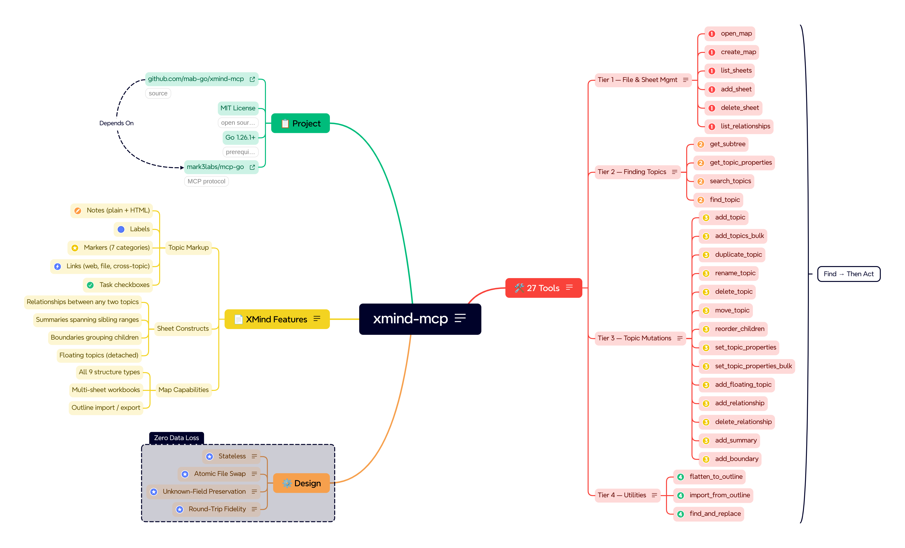

# xmind-mcp

<p align="center">
  <a href="https://github.com/mab-go/xmind-mcp/actions/workflows/ci.yml"></a>
  <a href="https://pkg.go.dev/github.com/mab-go/xmind-mcp"></a>
  <a href="https://deepwiki.com/mab-go/xmind-mcp"></a>
  <a href="LICENSE"></a>
</p>

An [MCP (Model Context Protocol)](https://modelcontextprotocol.io) server for
reading and writing local [XMind](https://xmind.com) mind map files. XMind MCP
exposes 27 tools that let any MCP-compatible AI client create, navigate, and
edit `.xmind` files directly on disk.

<p align="center">
  
</p>

------------------------------------------------------------------------

## Prerequisites

### Building

- Go 1.26.1 or later

### Using

- Any MCP-compatible client (Claude Desktop, Cursor, etc.)

------------------------------------------------------------------------

## Installation

### Using `go install` (recommended)

```bash
go install github.com/mab-go/xmind-mcp/cmd/xmind-mcp@latest
```

This fetches, builds, and installs the binary in one step. No cloning
required.

### Build from source

```bash
git clone https://github.com/mab-go/xmind-mcp.git
cd xmind-mcp
make build
```

The binary is written to `./bin/xmind-mcp` with version metadata from
`git` (see the `build` target in the `Makefile`). A plain
`go build ./cmd/xmind-mcp` also works but omits those ldflags.

> **Note:** A multi-platform container image is published to
> [GHCR](https://github.com/mab-go/xmind-mcp/pkgs/container/xmind-mcp) on
> each push to `main` and on version tags (see **Docker** below). Pre-built
> release binaries for all platforms may follow in a future release.

------------------------------------------------------------------------

## Docker

The image `ghcr.io/mab-go/xmind-mcp` runs the same stdio MCP server as the
host binary. Mount a host directory that contains your `.xmind` files and pass
paths **as seen inside the container** to the tools (for example, if you mount
`/home/you/maps` at `/maps`, use `/maps/my-map.xmind` in tool calls).

Build and load locally (single platform):

```bash
docker buildx build --platform linux/amd64 --load -t xmind-mcp:test .
```

Optional build arguments (defaults match a local build without git in context):

```bash
docker buildx build \
  --platform linux/amd64 \
  --load \
  --build-arg VERSION="$(git describe --tags --always --dirty 2>/dev/null || echo dev)" \
  --build-arg COMMIT="$(git rev-parse HEAD 2>/dev/null || echo unknown)" \
  --build-arg DATE="$(date -u +%Y-%m-%d)" \
  -t xmind-mcp:test .
```

Multi-platform build (no `--load`; suitable for CI or registry push):

```bash
docker buildx build --platform linux/amd64,linux/arm64 .
```

**Linux (amd64 host):** Building the `linux/arm64` variant runs `RUN` steps
inside an ARM image. Without [QEMU user emulation](https://docs.docker.com/build/building/multi-platform/#qemu),
those steps fail with `exec format error`. Install binfmt handlers once:

```bash
docker run --privileged --rm tonistiigi/binfmt --install all
```

Docker Desktop on macOS and Windows usually includes this. If you only need to
check that the Dockerfile builds on your machine, use `linux/amd64` only (the
first command above).

Run interactively (stdio requires `-i`):

```bash
docker run --rm -i -v /path/on/host:/maps xmind-mcp:test --version
```

### MCP client configuration (Docker)

For Claude Desktop, run the published image via `docker` and pass mounts in
`args` (adjust the host path). Example `claude_desktop_config.json`:

```json
{
  "mcpServers": {
    "xmind": {
      "command": "docker",
      "args": [
        "run",
        "-i",
        "--rm",
        "-v",
        "/path/on/host:/maps",
        "ghcr.io/mab-go/xmind-mcp:latest"
      ]
    }
  }
}
```

------------------------------------------------------------------------

## MCP Client Configuration

Add the following to your MCP client's configuration file. For Claude
Desktop, that's `claude_desktop_config.json`:

```json
{
  "mcpServers": {
    "xmind": {
      "command": "xmind-mcp"
    }
  }
}
```

If you built from source or the binary is not on your `PATH`, use the
full path to the binary:

```json
{
  "mcpServers": {
    "xmind": {
      "command": "/absolute/path/to/xmind-mcp"
    }
  }
}
```

------------------------------------------------------------------------

## Tools

All tools are prefixed with `xmind_` to avoid collisions in multi-server
environments.

### Tier 1: File & Sheet Management

| Tool                       | Description                                                                                    |
|----------------------------|------------------------------------------------------------------------------------------------|
| `xmind_open_map`           | Parse a `.xmind` file and return a structural summary (sheet names, root topics, node counts). |
| `xmind_list_sheets`        | Return the names and IDs of all sheets in a workbook.                                          |
| `xmind_create_map`         | Create a new `.xmind` file with a single sheet and root topic.                                 |
| `xmind_add_sheet`          | Add a new sheet to an existing workbook.                                                       |
| `xmind_delete_sheet`       | Remove a sheet from a workbook.                                                                |
| `xmind_list_relationships` | List all relationships on a sheet (endpoint ids and topic titles as JSON).                     |

### Tier 2: Finding Topics

Use these to resolve topic ids and titles before editing a specific branch
of the tree. Some write tools instead need sheet-level ids or ids from
`xmind_list_relationships`—see each tool’s description.

| Tool                         | Description                                                                                                                               |
|------------------------------|-------------------------------------------------------------------------------------------------------------------------------------------|
| `xmind_get_subtree`          | Return the full topic hierarchy rooted at a given topic (or the whole sheet).                                                             |
| `xmind_get_topic_properties` | Return one topic's metadata as JSON (notes, markers, boundaries, sheet relationships for that topic, child counts); use to verify writes. |
| `xmind_search_topics`        | Search for topics by keyword; returns matching topics with their IDs and context.                                                         |
| `xmind_find_topic`           | Find a single topic by exact title; returns its ID and immediate context.                                                                 |

### Tier 3: Topic Mutations

Most tools here target a topic and take a `topic_id` from Tier 2 (or from
prior results). A few use other ids (`from_id`/`to_id`, `relationship_id`,
etc.)—see each row.

On success, **`xmind_add_topic`**, **`xmind_add_topics_bulk`**,
**`xmind_duplicate_topic`**, and **`xmind_move_topic`** return **JSON** (topic
ids, insertion indices, sibling counts, and related fields). Exact keys match
each tool's description from the running MCP server. Other mutation tools in
this tier return plain-text success messages unless their descriptions say
otherwise.

| Tool                              | Description                                                                                                                  |
|-----------------------------------|------------------------------------------------------------------------------------------------------------------------------|
| `xmind_add_topic`                 | Add a new child topic under a specified parent; success body is JSON.                                                        |
| `xmind_add_topics_bulk`           | Add multiple topics (flat list or nested subtree) under a parent in one call; success body is JSON.                          |
| `xmind_duplicate_topic`           | Deep-clone a topic subtree under another parent (same sheet); sheet relationships are not copied; success body is JSON.      |
| `xmind_rename_topic`              | Change the title of an existing topic.                                                                                       |
| `xmind_delete_topic`              | Remove a topic and all its descendants.                                                                                      |
| `xmind_move_topic`                | Move a topic (and subtree) to a new parent; optional `position` sets insertion order (omit to append); success body is JSON. |
| `xmind_reorder_children`          | Change the order of a topic's children without reparenting.                                                                  |
| `xmind_set_topic_properties`      | Set or update topic metadata (notes, labels, markers, link, remove_markers); clearing rules are on the tool.                 |
| `xmind_set_topic_properties_bulk` | Apply the same metadata updates as `xmind_set_topic_properties` to many topic IDs in one read/write.                         |
| `xmind_add_floating_topic`        | Add a detached floating topic not connected to the main hierarchy.                                                           |
| `xmind_add_relationship`          | Draw a labeled connector between any two topics.                                                                             |
| `xmind_delete_relationship`       | Remove a relationship by id (from `xmind_list_relationships`).                                                               |
| `xmind_add_summary`               | Add a summary callout bracketing a range of sibling topics.                                                                  |
| `xmind_add_boundary`              | Add a visual boundary enclosure around all children of a topic.                                                              |

### Tier 4: Utilities

| Tool                        | Description                                                            |
|-----------------------------|------------------------------------------------------------------------|
| `xmind_flatten_to_outline`  | Export a sheet or subtree as indented plain text or Markdown.          |
| `xmind_import_from_outline` | Build a map or branch from an indented plain text or Markdown outline. |
| `xmind_find_and_replace`    | Rename topics matching a pattern across an entire sheet.               |

------------------------------------------------------------------------

## Development

First time only, install project-local tools (golangci-lint, goimports)
into `./bin`:

```bash
make setup
```

Then:

```bash
# Build (binary in ./bin/xmind-mcp), tests, and lint
make build test lint

# Run the server locally (stdio MCP)
make run
```

The primary test fixture is located at `testdata/kitchen-sink.xmind`. It
exercises every supported XMind feature and should be used as the baseline for
any handler development and testing. That file is stored in **Git LFS**; use a
clone with LFS enabled (or run `git lfs pull`) before `make test`, or tests will
fail on a pointer stub.

------------------------------------------------------------------------

## License

MIT. See [LICENSE](LICENSE).
